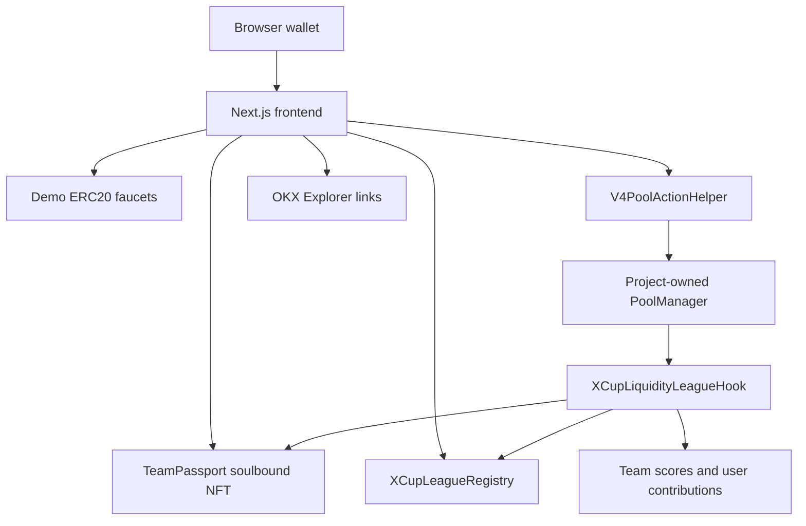

# X Cup Liquidity League

World Cup-style fan battles powered by Uniswap v4 hooks on X Layer testnet.

X Cup Liquidity League turns pool activity into live team support. Judges can claim demo tokens, mint a soulbound team passport, swap fan tokens, add liquidity support, change match states from an admin panel, and watch scores, fees, and contract events update in one frontend. It is a demo game mechanic, not betting, wagering, or a prediction market.

## Screenshots

- [P06-01 frontend shell](agent-system/04-summaries/screenshots/P06-01.png)
- [P06-02 faucet and passport](agent-system/04-summaries/screenshots/P06-02-faucet-passport.png)
- [P06-03 leaderboard and team cards](agent-system/04-summaries/screenshots/P06-03-leaderboard.png)
- [P06-04 swap panel](agent-system/04-summaries/screenshots/P06-04-swap.png)
- [P06-04 liquidity panel](agent-system/04-summaries/screenshots/P06-04-liquidity.png)
- [P06-05 match-state simulator](agent-system/04-summaries/screenshots/P06-05-match-state.png)
- [P06-05 event log](agent-system/04-summaries/screenshots/P06-05-event-log.png)
- [P06-05 contract proof](agent-system/04-summaries/screenshots/P06-05-contract-proof.png)

## Product

The MVP uses four demo teams: BRA, ARG, FRA, and GER. Each team has a fan token paired with xUSD in a Uniswap v4-style dynamic-fee pool. A soulbound Team Passport gives a wallet a supporter identity, and the hook awards points when that wallet swaps or adds liquidity. Match states such as GOAL_SHOCK or PENALTY change the active fee, while anti-wash logic can penalize rapid reversal patterns.

## Architecture



## Hook Callbacks

- `beforeSwap`: resolves the team and user, previews anti-wash status, applies a match-state base fee, applies supporter discount when eligible, adds anti-wash fee penalty when triggered, and returns the dynamic fee override.
- `afterSwap`: awards swap points, updates user contribution totals, updates anti-wash activity, and emits scoring or penalty events.
- `afterAddLiquidity`: awards LP points for positive full-range liquidity support and updates team/user contribution totals.

## X Layer Testnet Deployment

Explorer base: `https://www.okx.com/web3/explorer/xlayer-test`

| Artifact | Address / ID | Explorer |
|---|---|---|
| xUSD | `0x89AD049BbeD753E9213970Ea7F0727f85825e262` | [address](https://www.okx.com/web3/explorer/xlayer-test/address/0x89AD049BbeD753E9213970Ea7F0727f85825e262) |
| BRA | `0xC03713D4B186A2f762A6b301b8F805739a671bb3` | [address](https://www.okx.com/web3/explorer/xlayer-test/address/0xC03713D4B186A2f762A6b301b8F805739a671bb3) |
| ARG | `0x28b1F6d00177F6565310e9849aC1fe27FD6781d4` | [address](https://www.okx.com/web3/explorer/xlayer-test/address/0x28b1F6d00177F6565310e9849aC1fe27FD6781d4) |
| FRA | `0xf6A9f29Cac7F2e4353FE9378807014cCD32841EB` | [address](https://www.okx.com/web3/explorer/xlayer-test/address/0xf6A9f29Cac7F2e4353FE9378807014cCD32841EB) |
| GER | `0x8Aaf86dBc2922409F32693290cb7b88D5F3DAA32` | [address](https://www.okx.com/web3/explorer/xlayer-test/address/0x8Aaf86dBc2922409F32693290cb7b88D5F3DAA32) |
| PoolManager | `0x89EB7997ec0A7862ae25bAf44302cf2ac1554bD5` | [address](https://www.okx.com/web3/explorer/xlayer-test/address/0x89EB7997ec0A7862ae25bAf44302cf2ac1554bD5) |
| XCupLeagueRegistry | `0x5a1F521cAbc5b3b84518593C3EE09b7F978c2E50` | [address](https://www.okx.com/web3/explorer/xlayer-test/address/0x5a1F521cAbc5b3b84518593C3EE09b7F978c2E50) |
| TeamPassport | `0xaBf3AB75ac2B8d54E005C97e0f63fbeB82258358` | [address](https://www.okx.com/web3/explorer/xlayer-test/address/0xaBf3AB75ac2B8d54E005C97e0f63fbeB82258358) |
| XCupLiquidityLeagueHook | `0xea906F6E7D63D96E4D6782b6260a7a11587144c0` | [address](https://www.okx.com/web3/explorer/xlayer-test/address/0xea906F6E7D63D96E4D6782b6260a7a11587144c0) |
| LiquiditySeeder / V4PoolActionHelper | `0x693c37af40d21c5c0B4b34151a234D69919F1407` | [address](https://www.okx.com/web3/explorer/xlayer-test/address/0x693c37af40d21c5c0B4b34151a234D69919F1407) |
| BRA/xUSD pool ID | `0xac226e1ee3a5d5b56d33dbb8760019d5f2d59635bed752085d705ce2bece4380` | Pool ID |
| ARG/xUSD pool ID | `0xc59461cd61690d3b48635a550962c7f9491530eb4c181c435e51ba6c03c8f9cd` | Pool ID |
| FRA/xUSD pool ID | `0xa2a46908c90ebf39ed2f12938d0e29b5b3f4a94f09281ea9f99fc860368b65c8` | Pool ID |
| GER/xUSD pool ID | `0x1929af06898f12a50752e87f1e7bc370d77754f3006ec8ead85764ef4df808f6` | Pool ID |

Deployment manifests are committed under `deployments/1952/` and `deployments/xlayer-testnet/`.

## Network

- Network: X Layer testnet
- Chain ID: `1952`
- RPC: `https://testrpc.xlayer.tech/terigon`
- Explorer: `https://www.okx.com/web3/explorer/xlayer-test`
- Native token: OKB

No canonical X Layer testnet Uniswap v4 PoolManager was confirmed during deployment, so this MVP uses a clearly disclosed project-owned PoolManager on testnet.

## Demo Script

See [DEMO.md](DEMO.md) for the judge walkthrough. No hosted frontend URL exists yet; run locally at `http://127.0.0.1:3000`.

## Setup

### Contracts

```bash
cd contracts
forge build
forge test -vvv
```

### Frontend

```bash
cd frontend
pnpm install
pnpm dev --hostname 127.0.0.1 --port 3000
pnpm build
```

### Local Deployment Order

For a fresh local or testnet deployment, run the scripts in this order:

```bash
cd contracts
forge script script/DeployTokens.s.sol --rpc-url <rpc> --private-key $DEPLOYER_PRIVATE_KEY --broadcast
DEPLOY_OWN_POOL_MANAGER=true forge script script/DeployCore.s.sol --rpc-url <rpc> --private-key $DEPLOYER_PRIVATE_KEY --broadcast
forge script script/CreatePools.s.sol --rpc-url <rpc> --private-key $DEPLOYER_PRIVATE_KEY --broadcast
forge script script/SeedLiquidity.s.sol --rpc-url <rpc> --private-key $DEPLOYER_PRIVATE_KEY --broadcast
```

Do not commit private keys, `.env` files, or local `deployments/31337/` artifacts.

## Limitations

- No real betting, wagering, or prediction-market mechanics.
- No real sports oracle; match state is admin-controlled for the demo.
- No FIFA or licensed tournament assets.
- Demo tokens have no monetary value.
- One Team Passport per wallet; no team switching in the MVP.
- Project-owned PoolManager is used on X Layer testnet.
- Explorer verification remains best-effort/pending.
- Manual browser-wallet demo testing is still needed before final video recording.
- Event log uses bounded recent-block polling because the public X Layer testnet RPC limits `eth_getLogs` ranges.

## Future Work

- Move to a canonical PoolManager deployment if one becomes available on X Layer testnet.
- Add richer routing, quote previews, and slippage controls.
- Add a persistent event indexer for longer history.
- Polish video flow and add a live hosted frontend URL.
- Add more teams and tournament modes after the MVP.

## Submission Links

- Demo video: TBD
- X post: TBD
- Final form: TBD
